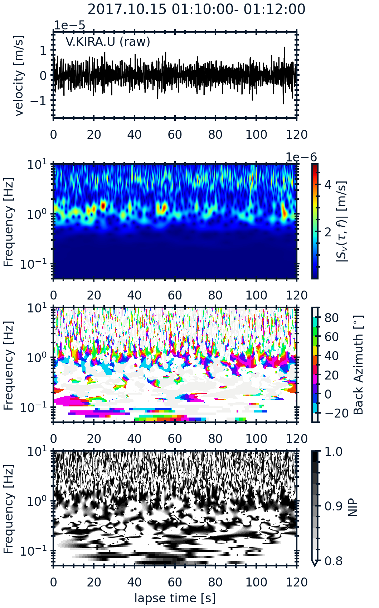
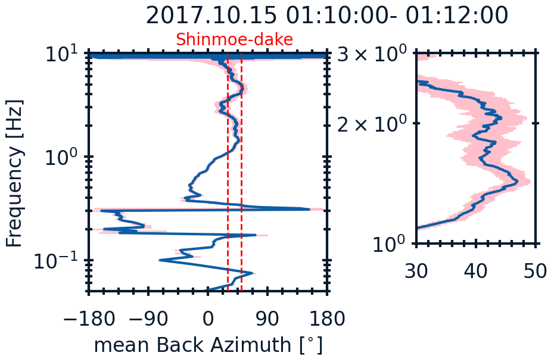

# Python codes to calculate back azimuths of retrograde Rayleigh waves (Hirose_and_Ueda_2024JGR)

## Description
This repository contains the functions used in Hirose and Ueda (2024) along with an example.
- example folder:
  - polanalysis_example_120s.py: Main code to estimate back azimuths of retrograde Rayleigh waves for 2-minute window.
  - core folder:
    - backazimuth.py: Function to estimate back azimuths.
  - nipfilter folder:
    - core.py: Functions for s-transform.
    - filter.py: Functions to calculate instantaneous propagation angles and NIP values.
    - st.py: ctypes interface to st.c
    - st.c: C code for s-transform.
  - utils folder:
    - circular.py: Functions for the circular statistics.
    - bootstrap.py: Function for the bootstrap method.
  - sac folder: sample data.

Depending on the OS and python version of your environment, the following edits may be necessary.
example/nipfilter/
- MacOS
  - The “311” in “libst.cpython-311-darwin.so” must match the version of python in your environment. For example, if you are using python 3.9, edit the file name as “libst.cpython-39-darwin.so”.
- Linux
  - The “311” in “libst.cpython-311m-x86_64-linux-gnu.so” must match the version of python in your environment. For example, if you are using python 3.9, edit the file name as “libst.cpython-39m-x86_64-linux-gnu.so”.
    

